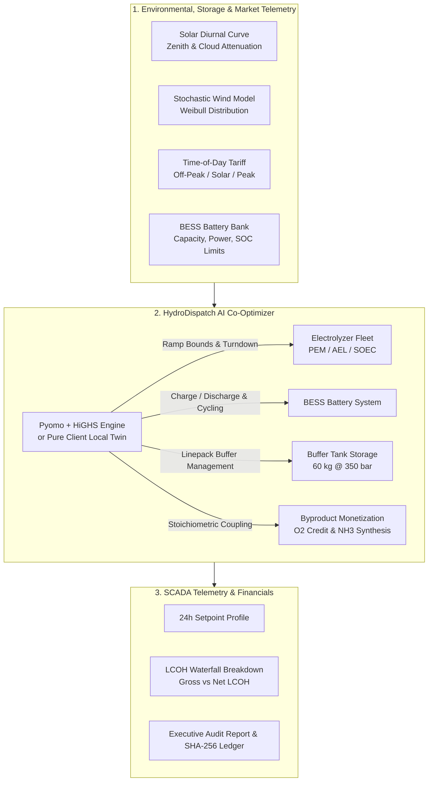

<div align="center">

# ⚡ HydroDispatch AI
### Physics-Informed Real-Time Dispatch & Levelized Cost (LCOH) Co-Optimization Engine for Green Hydrogen & E-Fuel Production

[](https://fastapi.tiangolo.com)
[](https://pyomo.org)
[](https://highs.dev)
[](https://www.docker.com/)
[](https://react.dev)
[](https://vite.dev)
[](https://tailwindcss.com)
[](https://web.dev/progressive-web-apps/)
[](LICENSE)

<p align="center">
  <strong>Bridging intermittent renewable generation (Solar PV + Wind) with multi-technology electrolyzer fleets (PEM, Alkaline, SOEC), Battery Energy Storage Systems (BESS), pressurized linepack buffer tanks, and dynamic Time-of-Day (ToD) electricity tariffs to minimize net LCOH (₹/kg), monetize co-produced Oxygen ($O_2$), and synthesize Green Ammonia ($NH_3$).</strong>
</p>

</div>

---

## 📌 Executive Summary

**HydroDispatch AI** is an industrial-grade Energy Management System (EMS) and Supervisory Control and Data Acquisition (SCADA) optimization console designed for multi-megawatt green hydrogen and derivative e-fuel facilities. 

Directly coupling electrolyzers to volatile solar and wind generation creates catastrophic thermal cycling, membrane degradation, and severe peak-tariff grid penalties. **HydroDispatch AI** solves this through a **96-interval (15-minute) Mixed-Integer Linear Programming (MILP)** plateau co-optimizer that dynamically schedules power allocation, manages BESS storage arbitrage, coordinates buffer tanks, smooths electrolyzer ramping, monetizes oxygen byproducts, and provides cryptographic proof-of-origin audit reports.

---

## 🌟 Key Capabilities

### 1. ⚡ Physics-Informed MILP Co-Dispatch Engine
* **96-Step Horizon (24 Hours)**: 15-minute predictive dispatch co-optimizing solar, wind, grid import, BESS charge/discharge, curtailment, and hydrogen production.
* **Ramping Plateau Smoothing**: Replaces erratic direct renewable tracking with ramp-constrained setpoints ($\Delta P \le 15\%$), reducing stack thermal stress by **up to 92.5%**.
* **Pyomo + HiGHS**: High-performance linear and integer mathematical optimization with sub-second execution times ($<85\text{ ms}$).

### 2. 🔋 BESS Battery Storage Arbitrage
* **Co-Optimized Electro-Chemical Storage**: Dynamic state-of-charge ($SOC_{\text{bess}}$) mass balance with $90.25\%$ round-trip efficiency ($\eta = 0.95$).
* **Solar-to-Peak Tariff Shifting**: Captures excess midday solar generation and discharges power during high evening tariff windows ($₹9.5-12.0/\text{kWh}$) to avoid expensive grid imports.
* **Degradation Cycling Cost Modeling**: Integrates battery throughput penalties ($₹0.40/\text{kWh}$) to optimize cell longevity.

### 3. 🫧 Byproduct Monetization & Green Ammonia ($NH_3$) Synthesis
* **Oxygen ($O_2$) Credit Monetization**: Stoichiometrically accounts for $8.0\text{ kg } O_2 \text{ / kg } H_2$ co-produced, reducing net Levelized Cost of Hydrogen ($LCOH$) via medical/industrial gas revenue credits.
* **Downstream Green Ammonia ($NH_3$) Coupling**: Models continuous Haber-Bosch reactor integration yielding $5.67\text{ kg } NH_3 \text{ / kg } H_2$.

### 4. 📜 Cryptographic Audit Dossier & Printable PDF Reports
* **SHA-256 Batch Verification**: Generates immutable cryptographic hashes for every 15-minute dispatch block.
* **Standards Compliance**: Verifies emissions intensity ($\le 2.0\text{ kg CO}_2/\text{kg } H_2$) conforming to the **National Green Hydrogen Mission (MNRE-GHM)** and **EU RFNBO** hourly additionality criteria.
* **Automated Audit Dossier**: Instant printable PDF dossier generation via `/dispatch/export-report`.

### 5. 📱 100% Offline-First PWA & Client Twin
* **Zero-Latency Client-Side Solver (`localOptimizer.js`)**: Pure JavaScript twin implementing identical BESS heuristics, $O_2$ monetization, and diurnal solar/wind algorithms for uninterrupted field operation.
* **Translucent Frosted Glass SCADA UI**: Modern industrial UI with live Modbus-TCP telemetry indicators, interactive 15-min scrubber, and multi-stack routing.

---

## 🏗️ System Architecture



---

## 📊 Mathematical & Physics Formulation

### 1. Power Balance & BESS Storage Dynamics
At each interval $t \in [1, 96]$:
$$P_{\text{ely}}[t] + P_{\text{bess\_ch}}[t] = P_{\text{re\_used}}[t] + P_{\text{grid}}[t] + P_{\text{bess\_dis}}[t]$$
$$SOC_{\text{bess}}[t] = SOC_{\text{bess}}[t-1] + \left( P_{\text{bess\_ch}}[t] \cdot \eta_{\text{ch}} - \frac{P_{\text{bess\_dis}}[t]}{\eta_{\text{dis}}} \right) \Delta t$$

### 2. Electrolyzer Hydrogen & Byproduct Production
$$m_{H_2}[t] = \frac{P_{\text{ely}}[t] \cdot \Delta t}{\text{SEC}_{\text{tech}}}$$
$$m_{O_2}[t] = 8.0 \times m_{H_2}[t], \quad m_{NH_3}[t] = 5.67 \times m_{H_2}[t]$$

### 3. Net Levelized Cost of Hydrogen ($\text{LCOH}_{\text{net}}$)
$$\text{LCOH}_{\text{net}} = \frac{\sum_{t=1}^T \left( P_{\text{re}} C_{\text{re}} + P_{\text{grid}} \text{Tariff}[t] + P_{\text{bess}} C_{\text{bess}} + R_{\text{ramp}} C_{\text{deg}} \right) \Delta t + \text{CAPEX} + \text{OPEX}_{\text{water}} - \text{Revenue}_{O_2}}{\text{Total } H_2 \text{ Produced (kg)}}$$

---

## 📁 Repository Structure

```text
hydrodispatch-ai/
├── backend/
│   ├── app/
│   │   ├── optimizer/
│   │   │   └── dispatcher.py         # Pyomo + HiGHS MILP co-dispatch formulation
│   │   ├── simulator/
│   │   │   └── generation_sim.py     # 96-step solar/wind generation & tariff simulator
│   │   └── main.py                   # FastAPI application with REST endpoints & audit dossier
│   ├── Dockerfile                    # Python 3.11 production container with HiGHS
│   ├── requirements.txt              # Backend dependencies
│   ├── test_api.py                   # REST API & endpoint integration tests
│   └── test_optimizer.py             # Optimizer MILP unit tests
├── frontend/
│   ├── public/
│   │   ├── manifest.json             # PWA standalone mobile manifest
│   │   ├── sw.js                     # Cache-First offline service worker
│   │   └── images/                   # High-resolution facility assets
│   ├── src/
│   │   ├── components/
│   │   │   ├── ComplianceLedger.jsx   # Cryptographic ESG ledger & PDF dossier export
│   │   │   ├── Controls.jsx           # Scenario sandbox with BESS & O2 sliders
│   │   │   ├── DegradationTwin.jsx    # Polarization kinetics & stack health
│   │   │   ├── DispatchChart.jsx      # 24-hr Recharts dispatch profile (Overlay/Split)
│   │   │   ├── FeatureScrollSection.jsx# Interactive 3-step physical optimization cards
│   │   │   ├── FinancialWaterfall.jsx # LCOH cost decomposition waterfall & O2 credit
│   │   │   ├── FleetMonitor.jsx       # 3-Stack heterogeneous fleet routing
│   │   │   ├── KpiCards.jsx           # Summary KPI metric cards & O2 yield
│   │   │   ├── LandingHero.jsx        # Compact hero section with live preview
│   │   │   ├── LiveSimPlayer.jsx      # 15-minute interval playback scrubber
│   │   │   ├── OverviewLanding.jsx    # Platform hub & facility asset showcase
│   │   │   ├── RoleSwitcher.jsx       # RBAC Persona Switcher Modal
│   │   │   ├── Sidebar.jsx            # Frosted translucent navigation drawer
│   │   │   └── StorageChart.jsx       # Buffer tank SOC & linepack dynamics
│   │   ├── utils/
│   │   │   └── localOptimizer.js      # Pure client-side zero-latency mathematical twin
│   │   ├── App.jsx                    # Core application layout & routing
│   │   └── main.jsx                   # React 19 entry point & PWA registration
│   ├── Dockerfile                    # Multi-stage production container (Node 20 -> Nginx)
│   ├── nginx.conf                    # Nginx reverse proxy configuration & caching
│   ├── package.json                   # Node.js dependencies
│   └── vite.config.js                 # Vite bundler configuration
├── docker-compose.yml                 # Production orchestration for backend & frontend
├── .dockerignore                      # Docker ignore rules
├── start_all.bat                      # Windows one-click dual server launcher
├── start_backend.bat                  # Windows backend launcher (Port 8000)
├── start_frontend.bat                 # Windows frontend launcher (Port 5173)
├── .gitignore                         # Git exclusion rules
└── README.md                          # Platform documentation
```

---

## 🚀 Quick Start Guide

### Option 1: Docker Compose (Recommended for Production)

Run the full stack with a single command:
```bash
docker compose up --build
```
* **Frontend Web App**: `http://localhost:5173`
* **FastAPI Backend Core**: `http://localhost:8000`
* **Swagger API Docs**: `http://localhost:8000/docs`

---

### Option 2: Automated Local Launcher (Windows)

Double-click or execute:
```bash
start_all.bat
```

---

### Option 3: Manual Step-by-Step Setup

#### 1. Backend Setup
```bash
cd backend
python -m venv venv

# Windows
.\venv\Scripts\activate
# Linux/macOS
source venv/bin/activate

pip install -r requirements.txt
python -m uvicorn app.main:app --host 127.0.0.1 --port 8000 --reload
```

#### 2. Frontend Setup
```bash
cd frontend
npm install
npm run dev
```

Open **[http://localhost:5173](http://localhost:5173)** in your browser!

---

## 📡 REST API Documentation

Interactive OpenAPI/Swagger documentation is available at **[http://127.0.0.1:8000/docs](http://127.0.0.1:8000/docs)**.

| Method | Endpoint | Description |
| :--- | :--- | :--- |
| `POST` | `/dispatch/run` | Executes 96-step Pyomo MILP optimizer with BESS, $O_2$ monetization & Ammonia metrics |
| `POST` | `/dispatch/export-report` | Generates official ISO 14064 & MNRE-GHM printable HTML/PDF audit dossier |
| `POST` | `/dispatch/export-csv` | Streams 24-hour dispatch time series as downloadable CSV |
| `GET` | `/health` | Health check probe returning active solver features and tech presets |
| `GET` | `/` | Root splash portal with live status indicators |

---

## 🧪 Verification & Testing

To run the automated mathematical test suite:

```bash
# 1. Optimizer Core Physics & Financial Tests
python backend/test_optimizer.py

# 2. REST API Integration & Export Tests
python backend/test_api.py

# 3. Frontend Production Compilation
cd frontend && npm run build
```

---

## 📄 License

This project is licensed under the **MIT License** — see the [LICENSE](LICENSE) file for details.

<div align="center">
  <sub>Engineered for next-generation clean hydrogen infrastructure. Powered by Pyomo, HiGHS MILP, and React 19.</sub>
</div>
