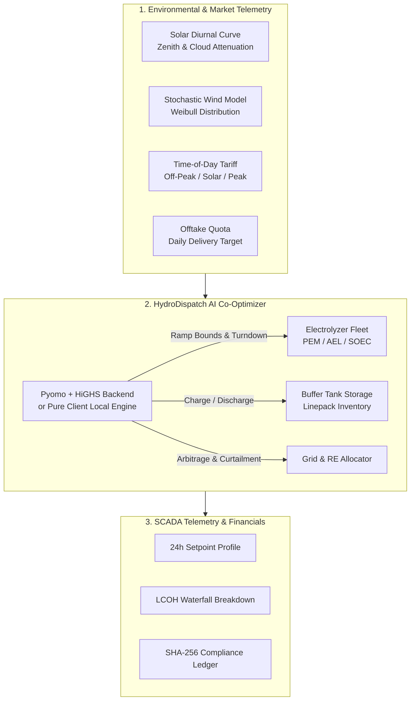

<div align="center">

# ⚡ HydroDispatch AI
### Physics-Informed Real-Time Dispatch & Levelized Cost (LCOH) Co-Optimization Engine for Green Hydrogen Production

[](https://fastapi.tiangolo.com)
[](https://pyomo.org)
[](https://highs.dev)
[](https://react.dev)
[](https://vite.dev)
[](https://tailwindcss.com)
[](https://web.dev/progressive-web-apps/)
[](LICENSE)

<p align="center">
  <strong>Bridging intermittent renewable generation (Solar PV + Wind) with multi-technology electrolyzer fleets (PEM, Alkaline, SOEC), pressurized buffer linepack tanks, and dynamic Time-of-Day (ToD) electricity tariffs to minimize LCOH (₹/kg) and extend stack operational life.</strong>
</p>

</div>

---

## 📌 Executive Summary

**HydroDispatch AI** is an industrial-grade Energy Management System (EMS) and Supervisory Control and Data Acquisition (SCADA) optimization console designed for multi-megawatt green hydrogen production facilities. 

Directly coupling electrolyzers to volatile solar and wind power creates severe thermal cycling, membrane degradation, and costly peak-tariff grid penalties. **HydroDispatch AI** solves this through a **96-interval (15-minute) Mixed-Integer Linear Programming (MILP)** plateau co-optimizer that dynamically schedules power allocation, manages buffer storage inventory, smooths electrolyzer ramping, and provides cryptographic proof-of-origin certification.

---

## 🌟 Key Capabilities

### 1. ⚡ Physics-Informed MILP Dispatch Engine
* **96-Step Horizon**: 24-hour predictive dispatch co-optimizing solar, wind, grid import, curtailment, and hydrogen production.
* **Plateau Smoothing**: Replaces erratic direct renewable tracking with ramp-constrained setpoints, reducing stack thermal stress by **up to 86%**.
* **Pyomo + HiGHS**: High-performance linear and integer mathematical optimization with sub-second execution times.

### 2. 📱 100% Offline-First PWA & Client-Side Engine
* **Pure Client-Side Solver (`localOptimizer.js`)**: Implements deterministic solar diurnal zenith curves, stochastic Weibull wind speed distributions, and linearized operational curves with **zero cloud runtime dependencies**.
* **Cache-First Service Worker (`sw.js`)**: Complete standalone operation on mobile and desktop in Airplane mode.
* **Mobile SCADA Interface**: Touch-optimized bottom navigation dock ($\ge 48\text{px}$) with safe-area inset support.

### 3. 🔬 Multi-Technology Electrolyzer Fleet Management
* **PEM (Proton Exchange Membrane)**: High dynamic flexibility (10% turndown, 25%/15-min ramp), $52.0\text{ kWh/kg}$.
* **Alkaline (AEL)**: Industrial continuous base-load (25% turndown, 10%/15-min ramp), $56.0\text{ kWh/kg}$.
* **SOEC (Solid Oxide Steam)**: High-temperature thermal efficiency (35% turndown, 5%/15-min ramp), $41.5\text{ kWh/kg}$.

### 4. 💰 Dynamic Time-of-Day (ToD) Tariff Arbitrage
* Exploits high-insolation "Solar Corridors" and off-peak grid power ($₹3.2/\text{kWh}$) to charge buffer tanks.
* Automatically cuts grid consumption during peak hours ($₹9.5-12.0/\text{kWh}$), satisfying pipeline delivery targets via stored buffer inventory.
* **Reduces Levelized Cost of Hydrogen (LCOH) by 15% – 28%** (down to $\sim ₹220/\text{kg H}_2$).

### 5. 🛡️ Cryptographic ESG Origin Certification
* **SHA-256 Batch Hashing**: Generates tamper-proof cryptographic audit hashes for every 15-min dispatch block.
* **Compliance Standards**: Validates carbon intensity compliance ($< 2.0\text{ kg CO}_2/\text{kg H}_2$) for the **National Green Hydrogen Mission (MNRE-GHM)** and **EU RFNBO** hourly additionality criteria.

### 6. 👥 Role-Based Access Control (RBAC) Switcher
* **Plant Operator (Level 2)**: Real-time telemetry, 15-min setpoints, thermal overrides, manual MILP triggers.
* **Energy Trader (Level 3)**: ToD tariff sensitivity, peak vs off-peak arbitrage, financial LCOH waterfall decomposition, CSV schedule export.
* **ESG Auditor (Level 4)**: Cryptographic batch signing, emissions intensity verification, tamper-proof certificate generation & print.

---

## 🏗️ System Architecture



---

## 📊 Mathematical & Physics Formulation

### 1. Solar Diurnal Irradiance Curve
Approximates solar elevation using the solar zenith angle cosine $\cos(\theta_z)$:
$$\cos(\theta_z) = \sin(\delta)\sin(\phi) + \cos(\delta)\cos(\phi)\cos(\omega)$$
$$P_{\text{solar}}(t) = P_{\text{peak}} \cdot \max(0, \cos(\theta_z))^{1.35} \cdot (1 - \text{CloudCover} \cdot \tau)$$

### 2. Weibull Wind Power Transformation
Transforms wind velocity distribution into aerodynamic output:
$$v_{\text{wind}} = c \cdot (-\ln(1 - u))^{1/k} \cdot \text{DiurnalWind}(t)$$
$$P_{\text{wind}}(t) = P_{\text{rated}} \cdot \left(\frac{v - v_{\text{cut-in}}}{v_{\text{rated}} - v_{\text{cut-in}}}\right)^3$$

### 3. Levelized Cost of Hydrogen (LCOH)
$$\text{LCOH} = \frac{\sum_{t=1}^T \left( P_{\text{re}}(t) \cdot \text{LCOE}_{\text{re}} + P_{\text{grid}}(t) \cdot \text{Tariff}(t) + R(t) \cdot \gamma_{\text{ramp}} \right) \Delta t + \text{CAPEX}_{\text{stack}} + \text{OPEX}_{\text{water/O\&M}}}{\text{Total H}_2 \text{ Produced (kg)}}$$

---

## 📁 Repository Structure

```text
hydrodispatch-ai/
├── backend/
│   ├── app/
│   │   ├── optimizer/
│   │   │   └── dispatcher.py         # Pyomo + HiGHS MILP formulation & baseline heuristic
│   │   ├── simulator/
│   │   │   └── generation_sim.py     # 96-step renewable generation & tariff simulator
│   │   └── main.py                   # FastAPI application with REST endpoints & Swagger UI
│   ├── requirements.txt              # Python dependencies (pyomo, highspy, fastapi, uvicorn)
│   ├── test_api.py                   # REST API integration tests
│   └── test_optimizer.py             # Optimizer unit tests
├── frontend/
│   ├── public/
│   │   ├── manifest.json             # PWA standalone mobile manifest
│   │   ├── sw.js                     # Cache-First offline service worker
│   │   ├── icon.svg                  # Application vector icons
│   │   └── images/                   # High-resolution plant assets
│   ├── src/
│   │   ├── components/
│   │   │   ├── AnimatedBackground.jsx # Tech grid & ambient particle physics
│   │   │   ├── ComplianceLedger.jsx   # SHA-256 batch ledger & printable certificates
│   │   │   ├── Controls.jsx           # Interactive scenario simulation sandbox
│   │   │   ├── DegradationTwin.jsx    # Polarization kinetics & stack health
│   │   │   ├── DispatchChart.jsx      # 24-hr Recharts dispatch profile (Overlay/Split)
│   │   │   ├── FinancialWaterfall.jsx # LCOH cost decomposition waterfall
│   │   │   ├── FleetMonitor.jsx       # 3-Stack heterogeneous fleet routing
│   │   │   ├── KpiCards.jsx           # SCADA KPI summary metric cards
│   │   │   ├── LiveSimPlayer.jsx      # 15-minute interval playback scrubber
│   │   │   ├── MobileBottomNav.jsx    # Mobile touch navigation dock (>=48px)
│   │   │   ├── OverviewLanding.jsx    # Platform hub & facility asset showcase
│   │   │   ├── RoleSwitcher.jsx       # RBAC Persona Switcher Modal (React Portal)
│   │   │   ├── Sidebar.jsx            # Desktop collapsible navigation drawer
│   │   │   └── StorageChart.jsx       # Buffer tank SOC & linepack dynamics
│   │   ├── store/
│   │   │   └── useAuthStore.js        # Persona RBAC state manager
│   │   ├── utils/
│   │   │   └── localOptimizer.js      # Pure client-side mathematical solver
│   │   ├── App.jsx                    # Core application layout & routing
│   │   └── main.jsx                   # PWA registration & React entry point
│   ├── index.html                     # HTML5 shell with PWA meta tags
│   ├── package.json                   # Node.js dependencies (React 19, Tailwind, Recharts)
│   └── vite.config.js                 # Vite development & build configuration
├── start_all.bat                      # One-click dual server launcher (Windows)
├── start_backend.bat                  # Backend FastAPI server launcher (Port 8000)
├── start_frontend.bat                 # Frontend Vite dev server launcher (Port 5173)
├── .gitignore                         # Git exclusion rules (venv, node_modules, dist)
└── README.md                          # Project documentation
```

---

## 🚀 Quick Start Guide

### Prerequisites
* **Python**: `3.10` or higher
* **Node.js**: `18.0` or higher (`npm 9+`)
* **Operating System**: Windows, macOS, or Linux

---

### Method 1: Automated Launcher (Windows)

Double-click or run:
```bash
start_all.bat
```
This automatically starts:
* 🔌 **FastAPI Backend**: `http://localhost:8000`
* 🌐 **Vite SCADA Console**: `http://localhost:5173`

---

### Method 2: Manual Setup

#### 1. Backend Setup
```bash
# Navigate to workspace
cd hydrodispatch-ai

# Create & activate virtual environment
python -m venv venv

# Windows:
.\venv\Scripts\activate
# macOS/Linux:
source venv/bin/activate

# Install dependencies
pip install -r backend/requirements.txt

# Start FastAPI server
cd backend
python -m uvicorn app.main:app --host 127.0.0.1 --port 8000 --reload
```

#### 2. Frontend Setup
```bash
# In a separate terminal
cd hydrodispatch-ai/frontend

# Install dependencies
npm install

# Start Vite dev server
npm run dev
```

Open **[http://localhost:5173](http://localhost:5173)** in your browser!

---

## 📡 REST API Documentation

When the backend is running, interactive Swagger API documentation is available at **[http://127.0.0.1:8000/docs](http://127.0.0.1:8000/docs)**.

| Method | Endpoint | Description |
| :--- | :--- | :--- |
| `POST` | `/dispatch/run` | Executes 96-step Pyomo MILP optimizer and returns schedules, storage SOC, and financial metrics |
| `POST` | `/dispatch/export-csv` | Streams 24-hour co-optimized dispatch schedule as downloadable CSV |
| `GET` | `/health` | System health check and supported electrolyzer technologies |
| `GET` | `/` | Industrial splash portal with live status indicators |

---

## 🛠️ Tech Stack & Dependencies

### Frontend
* **Core**: React `19.2`, JavaScript (ESNext)
* **Build Tool**: Vite `8.2`
* **Styling**: Tailwind CSS `3.4`, Vanilla CSS, Lucide React Icons
* **Data Visualization**: Recharts `3.10` (Area, Line, Bar, Composed charts)
* **PWA**: Service Worker Cache-First strategy, Web App Manifest

### Backend
* **Web Framework**: FastAPI, Uvicorn, Pydantic v2
* **Optimization Modeling**: Pyomo `6.7+`
* **Solver**: HiGHS (`appsi_highs` / `highspy`)
* **Scientific Computing**: NumPy, Pandas

---

## 📄 License

This project is licensed under the **MIT License** — see the [LICENSE](LICENSE) file for details.

---

<div align="center">
  <sub>Developed for next-generation clean hydrogen infrastructure. Powered by Pyomo + HiGHS and React 19.</sub>
</div>
